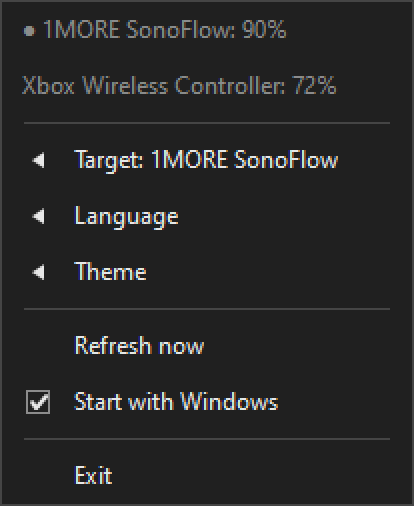
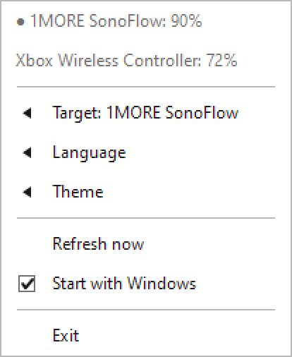
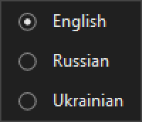

# BtBatteryTray

[English](README.md) · **Русский** · [Українська](README.uk.md)

Небольшое приложение для трея Windows: показывает заряд Bluetooth-устройств — наушников, колонок, мыши, клавиатуры, геймпада — прямо в области уведомлений.

## Что оно делает

- показывает **только реально подключённые** устройства;
- рисует заряд выбранного устройства-**цели** в иконке трея, а если цель не выбрана — самое низкое значение;
- выводит названия устройств и их заряд в подсказке трея;
- предупреждает о низком заряде;
- тёмная и светлая темы меню;
- интерфейс на **английском**, **русском** и **украинском**;
- по желанию запускается вместе с Windows;
- без установщика, без зависимостей и без доступа к сети.

Список обновляется раз в 60 секунд. Пункт **«Обновить сейчас»** запускает обновление немедленно.

## Скриншоты

| Тёмная тема | Светлая тема |
|:---:|:---:|
|  |  |

Подменю — **Цель**, **Язык**, **Тема** — открываются слева от основного меню, само меню остаётся видимым:



*Изображения выше отрисованы самим приложением (диагностический режим `--rendertest`) и попиксельно совпадают с тем, что видно на экране.*

## Скачать и запустить

1. Скачайте `BtBatteryTray.exe` со страницы [Releases](https://github.com/ProfessorSovers/btbatterytray/releases).
2. Положите файл в любую папку и запустите.
3. В области уведомлений появится иконка. Клик по ней открывает меню.

Больше ничего не нужно: ни установщика, ни .NET или Rust, ни дополнительных DLL, ни настройки. Файл самодостаточный, а настройки хранятся в реестре (см. ниже), поэтому его можно свободно переносить и переименовывать.

Для обновления просто замените файл на более новый и перезапустите приложение. Автообновления и фоновой службы нет.

## Использование

Меню открывается кликом по иконке в трее.

- **Цель** — за каким устройством следить в иконке: конкретное устройство или *«Авто (самое разряженное)»*.
- **Язык** — английский / русский / украинский.
- **Тема** — тёмная или светлая.
- **Обновить сейчас** — запросить обновление немедленно.
- **Автозапуск** — добавить или убрать запись из автозагрузки.
- **Выход** — закрыть приложение.

В подсказке трея перечислены все подключённые устройства с зарядом — она появляется при наведении на иконку.

Настройки хранятся отдельно для пользователя:

```text
HKCU\Software\BtBatteryTray
```

Диагностический лог пишется в:

```text
%LOCALAPPDATA%\BtBatteryTray\log.txt
```

Лог ограничен примерно 200 КБ и содержит только названия устройств, заряд и тайминги. Сетевых запросов и телеметрии в приложении нет.

## Ограничения

Заряд отдаёт сама Windows — через Bluetooth-адаптер, устройство и его драйвер. Поэтому:

- сопряжённое устройство показывается только пока оно действительно подключено;
- подключённое устройство может отсутствовать, если Windows вообще не сообщает его заряд;
- значение может приходить с задержкой: как часто его отправлять, решает само устройство.

Если Windows совсем не может сообщить статус подключения, приложение показывает все устройства с доступным зарядом, а не пустой список.

Приложение не обращается к облачным сервисам производителей и не обходит Bluetooth-API Windows.

## Диагностика

Пригодится при сообщении о проблеме:

```text
BtBatteryTray.exe --conntest      # найденные устройства, вердикт подключения и время проверки
BtBatteryTray.exe --rendertest    # отрисовка меню в BMP-файлы в текущей папке
BtBatteryTray.exe --balloontest   # сразу показать уведомление о низком заряде
                                  # (процент синтетический: реальный триггер — ниже 20%;
                                  #  свой уровень: --balloontest=5)
```

Первые два режима самостоятельные: печатают или пишут файл и завершаются, не запуская иконку в
трее. `--balloontest` показывает уведомление на несколько секунд и завершается; его можно
запускать, даже когда приложение уже работает.

## Сборка из исходников

Этот раздел — для разработчиков. Если вы просто хотите пользоваться приложением, скачайте готовый файл из Releases — см. выше.

Требования:

- Windows 10 или новее (x64);
- Rust и Cargo: <https://rustup.rs/>.

```text
cargo build --release
```

Готовый файл появится в `target\release\BtBatteryTray.exe`.

Запуск тестов:

```text
cargo test --locked
```

## Лицензия

MIT. См. [LICENSE](LICENSE).

## Статус

Разрабатывается и тестируется на Windows 10. Сообщает ли конкретное Bluetooth-устройство свой заряд — решают Windows и драйвер устройства.
